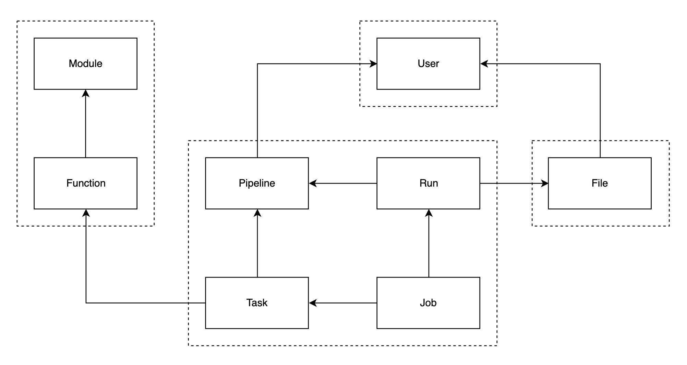

# MLsploit REST API

The MLsploit REST API service manages the data storage and retrieval 
for the MLsploit framework via HTTP requests. 
It has been developed using `Django REST Framework`.
This RESTful API service returns data in JSON format,
where the nested model references are in URL identifier form.

## API Architecture



The above diagram shows the API architecture of the MLsploit framework.
The arrows in the diagram show relationships between the model components
(e.g., `User` is a foreign key in the `File` model 
since one user can own several files).
Each model component in the architecture is implemented as a Django Model.
The dotted lines denote that the model components are structured 
within a single Django app in the codebase 
(such as `modules`, `pipelines`, `files` and `users`). 

Here is a summary outlining the model dependencies of the API architecture:
- A `Module` contains several instances of `Function` items.
- A `User` can upload many `File` objects and can create several `Pipeline` objects.
- A `Pipeline` can be seen as an ordered list of several `Task` instances 
  which are to be performed one after the other.
- Every `Task` instance contains the arguments associated to a `Function` 
  that has to be executed.
- A `Run` object associates which `File` objects should be used as the input to a `Pipeline`.
- A `User` can create many `Run` objects with different `File` objects.
- A `Job` contains the output from each `Task` of the `Pipeline` for a particular `Run`.

## Environment Variables

The configuration settings of the REST API are stored
inside the `.env` file.

You should update the `MLSPLOIT_API_SECRET_KEY` before setting up the service
since it is necessary for the security of the REST API.
It should ideally be a random string with at least 50 characters, 
and should contain lowercase, uppercase, numeric as well as special characters.
You can use [this tool](https://pinetools.com/random-string-generator)
to quickly generate a secret key.

Here is a short description of the environment variables:
- `MLSPLOIT_API_SECRET_KEY` is the key that is used by Django 
  to securely store and exchange data.
- `MLSPLOIT_API_ALLOWED_HOSTS` is the comma-separated list of IP addresses 
  that are allowed to access the REST API. All IP addresses are allowed by default.
- `MLSPLOIT_API_SCRATCH_DIR` is the path to a "scratch" directory where 
  the REST API stores required artifacts generated during execution.
- `MLSPLOIT_API_DB_PATH` is the path to the SQLite3 database file 
  that the REST API uses for storing all the data. 
  It is created inside the scratch directory by default.
- `MLSPLOIT_API_MEDIA_DIR` is the path to a directory where 
  all the files uploaded by the users are stored. 
  It is also created inside the scratch directory by default.

## Docker Setup

To jump start the setup, we provide a `Dockerfile` and a `docker-compose` configuration 
for running the REST API service. 
This is the recommended way for setting up, developing and testing the REST API.
You will need to setup [docker](https://www.docker.com/get-started) on your system,
and then run the following commands.

### Build the Docker images

```bash
$ bash docker-setup-api.sh
```

This will build the `docker-compose` service using the provided `Dockerfile`.

### Create a super user (administrator)

```bash
$ bash docker-manage-api.sh createsuperuser --username admin
```

Running this command will prompt the user to enter an email address and a password on the terminal,
and then create the *admin* user.

> Note: The administrator is a special user who cannot upload files or create pipelines.
  You should create a new user at the `/auth/registration` endpoint after starting the service
  for  testing the functionality of the API (such as uploading files or creating pipelines).

#### Create an admin token

```bash
$ bash docker-manage-api.sh drf_create_token admin
```

Running this command will create an access token that you can supply to 
the `MLSPLOIT_API_ADMIN_TOKEN` environment variable of the backend execution service
(see [here](https://github.com/mlsploit/mlsploit-execution-backend#environment-variables) for more details).

### Create modules

```bash
$ bash docker-manage-api.sh createmodule helloworld https://github.com/mlsploit/module-helloworld.git
```

### Remove modules

```bash
$ bash docker-manage-api.sh removemodule helloworld
```

### Start the API server

```bash
$ bash docker-start-api.sh
```

This will start the REST API service at port 8000 on your system.
You can access the API at **127.0.0.1:8000/api/v1**.
You can also use **127.0.0.1:8000/auth/registration** 
and **127.0.0.1:8000/auth/login** for registration and login respectively.
The API documentation for each endpoint will be available at
**127.0.0.1:8000/docs**.

## Manual Setup

### Install the dependencies

```bash
$ pip install -r requirements.txt
```

### Provision the database

```bash
$ python manage.py makemigrations
$ python manage.py migrate
```

### Create a super user (administrator)

```bash
$ python manage.py createsuperuser --username admin
```

#### Create an admin token

```bash
$ python manage.py drf_create_token admin
```

### Create modules

```bash
$ python manage.py createmodule helloworld https://github.com/mlsploit/module-helloworld.git
```

### Remove modules

```bash
$ python manage.py removemodule helloworld
```

### Start the API server

```bash
$ python manage.py runserver
```

This will start the server on port 8000.
